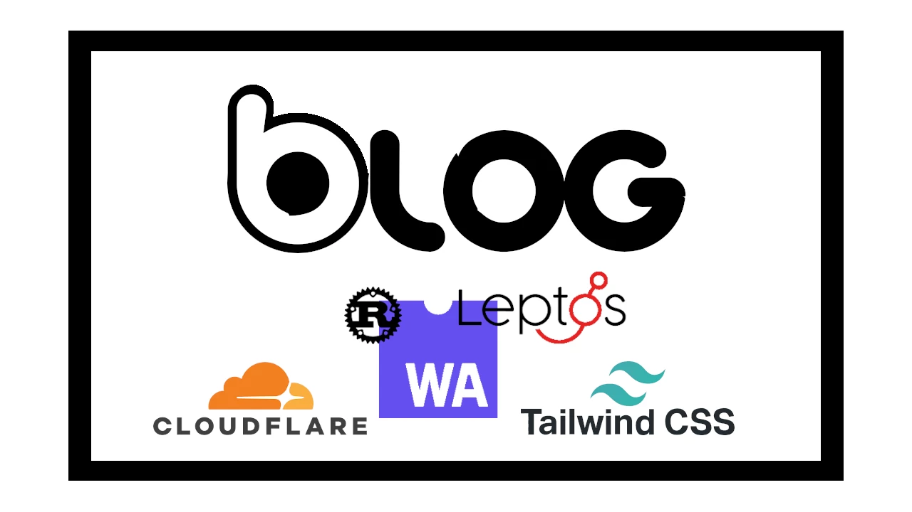

# Behind the Blog
## The Journey of Creating This Site

This is not a guide to creating a blog, I just want to show the way I went about it.
Also, this was my first attempt at creating a static site, and there are probably better ways to do it, but I enjoyed the journey so much, that wanted to share the process.  

Let's start with my requirements:

* I wanted to learn something new.
* I wanted a to create a Single Page App without having any backend.
* I wanted as little maintenance as possible.
* I wanted to be able to add posts easily (without rebuilding the site).
* I wanted to be able to get feedback on my posts.
* I wanted to spend as little time and money as possible.

 
There are a lot of static site generators out there, but as a software engineer, I felt like there was no fun in using them...so it wasn't an option for me. I mean, I do this for a living, so I had to do it the hard way. 
Also, when I build something for myself, I usually want to learn as well, which is why I chose the tech stack below:

### [Rust](https://www.rust-lang.org)+[WASM](https://webassembly.org)
I wanted to use a language that I didn't have much experience with. Although Javascript would have fit the bill, there was another language that I really liked, which was Rust. 
I had some knowledge of Rust, but I didn't have any hands-on experience, so I felt like this was a good opportunity to get some. 
At first I thought that creating SPA websites was only possible using Javascript/Typescript (like I said, I was a bit dumb in that area and still am), but I actually found out that it is possible to run almost any language if it can be compiled to WASM. 
"WebAssembly is a simple machine model and executable format with a comprehensive specification. It is designed to be portable, compact, and run at or near native speed."

### Leptos
So at this point I had the language chosen, but I still had to pick a framework. 
Rust has many frontend frameworks and I checked out a few of them:
* [Yew](https://yew.rs)
* [Dioxus](https://dioxuslabs.com)
* [Leptos](https://leptos.dev)

Each of these frameworks has both client and server side rendering and lots of cool features. 
All three frameworks looked really good and I could have chosen any of them. Yew and Leptos use HTML-like syntax to create the elements, which I really liked, so that eliminated Dioxus.  
Both Leptos and Yew felt great, but I ended up choosing Leptos. 
It wasn't that one was better than the other, I just liked it more based on the toy sites I made.

### [Tailwind](https://tailwindcss.com)
There was one topic left... the styling. I had written css before, but I felt like I had skill issues there... I tried Bootstrap but hated it, so I started reading up on the subject and then found Tailwind. 
Tailwind offers a lot of flexibility and customization and it is really easy to build custom components with it (even for a newbie like me). I tried building an initial design with Tailwind and it went so smoothly that I had no doubt that it was the way to go.

### Uploading posts
This requirement was a bit tricky... What I wanted to achieve here is that once I'm done with the site, I don't want to touch it unless I need to make a fundamental change... Writing posts should be easy and it shouldn't even trigger a new build for the site. 
Achieving this without a real backend was not so easy, but I came up with the idea of just having my posts as markdown files and host them separatelly. So I ended up having two projects, one for the source code of the blog and the other containing all the content necessary for the posts.

The project for the blog contents has the following structure:
* The post metadata 
  * this is just a json file that describe where teh posts are and some other methadata
* the posts folder
  * each post is a separate markdown file
* the images folder
  * images for the posts

But how does it all fit together? Well, the blog fetches the metadata json at startup and creates a preview for each post. When a user opens the post, it is downloaded and converted to html on the fly.
### Getting feedback

Being able to get feedback is important in to me, so for that I needed a comment section... 
There are many commenting systems out there with free and paid subscriptions. Some of them were really appealing, but I didn't really want to have another dependency like that. Each of them required a registration, a subscription (even if it is free), and I wanted to limit these different tools in favor of maintainability. 
Finally I found [GisCus](https://giscus.app), which is a commenting system built on top of Github discussions. Since I keep my code and posts on Github, Giscus seemed like the right tool for the job. All I had to do was add a script tag at the end of my post page and create a discussion for each post on github (having to create a discussion manually is an overhead - it could be automated though - but even doing it manually is still worth it to me). 

### Hosting the site

As I mentioned before, I wanted to spend the minimum amount of money to host the blog, so I needed a free hosting service. 
At first I tried hosting it on github pages, but unfortunately it does not handle routing of single page applications very well, so I had to find something else. 
Someone suggested [CloudFlare pages](https://pages.cloudflare.com) so I checked it out and it seemed really cool...
* Multiple deployments
* Rollback deployments
* Flawless routing of SPAs
* Github integration
  * Branch monitoring and automatic upload
  * Github action
* Free (at least for a simple use case like this)
* And more...

### Cost
Since most of the tools I used are open source or free, the only thing I had to pay for was the custom domain.
  
That is all... It took me some time and effort, but I am proud that I was able to do it in a cost effective way...
It's been fun, I hope you enjoyed it as well.
  
See you next time.

