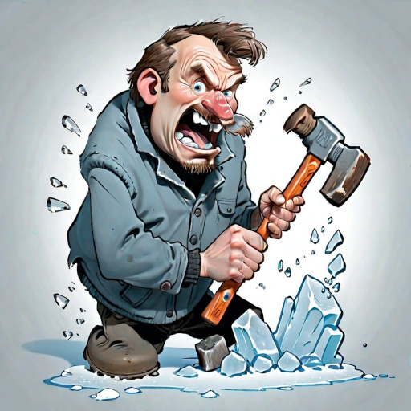

# Breaking the ice

I've wanted to have a blog for a long time, but it's been really hard to get myself to do it. 
I made a lot of excuses, like I don't have the skills, I'm bad at design and many more... 
When I finally did it, I immediately faced the next obstacle: writing a post (which I am now trying to overcome). 
I wanted to have a blog because I feel like I always keep my thoughts to myself and it would give me a way to share them. 
So when it comes to actually writing them down I get nervous because I feel like what if my English isn't strong enough, what if I write something stupid and people start laughing at me. 
Well, those are all possible outcomes, but on the other hand, everyone has to start somewhere and I can't get better at something I never start. If I write something wrong, I can always correct it. 
If I write something that people don't agree with, that's fine, people are different. So all these excuses just stop me from growing and getting better. 

I am writing this post to break the ice and finally start writing. Hopefully there will be more to come with more meaningful content :)
Have a great day and see you soon!

