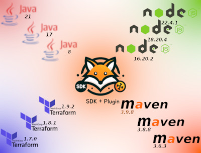

# Effortless Environment Setup
## Streamline Your Workflow with the [VFox Version Manager](https://vfox.lhan.me/)

Ever found yourself struggling to manage multiple development tools and versions, wishing there was an easier way? Don't worry, managing development tools can indeed become quite challenging when working on complex projects with multiple languages and tools.

### The Challenges of Managing Development Tools

Even in a relatively simple scenario where you use the same versions across all projects and environments, you still have numerous SDKs and tools to manage.. For example, if you have Java, Scala, and Node.js microservices, and you use Kubernetes to run those services, you have at least three different SDKs, build tools for each language, and tools to manage/access the infrastructure. That means you already have seven things to install and some may require additional configuration, such as setting up the correct path.

Now, imagine a more complex scenario where different services or environments use different versions. For instance:
* **Java**: One microservice might require Java 8 while another needs Java 17.
* **Scala**: Your older services use Scala 2.13, but newer ones are on Scala 3.4.
* **Kubernetes**: Development and staging environments might be on different Kubernetes versions due to gradual updates.

In these cases, you need to manage multiple versions of each tool on your machine. Keeping track of these versions and ensuring they are configured correctly can be frustrating and time-consuming.<br/>

### Solution

So, what can you do about it?

You could use a tool to manage them for you. There are several available, such as SDKMan, nvm, and jenv, but they usually support only a few SDKs or tools.<<br/><br/>
For example:
* **SDKMan**: Great for managing JVM-based tools like Java, Scala, and Groovy.
* **nvm**: Ideal for versioning Node.js.
* **jenv**: Perfect for managing different versions of Java.

However, relying on multiple tools to configure your development environment brings us back to the main problem: complexity.

### Introducing The VFox Version Manager

There is an awesome version manager that stands out from the rest: **[VFox](https://vfox.lhan.me/)**.

VFox is designed to simplify the management of SDKs and tools by supporting a wide range of them out of the box. Whether you’re dealing with different versions of Java, Node.js, Python, or even specific tools like kubectl and Terraform, VFox has you covered.<br/>
Here’s how VFox can make your life easier:<br/>

* **Unified Management**: Manage all your SDKs and tools from a single interface, eliminating the need for multiple version managers.
* **Version Control**: Easily switch between different versions of the same tool, ensuring compatibility across projects and environments.
* **Configuration Simplification**: Automatically handle path settings and environment variables, reducing setup time and errors.
* **Extensive Support**: VFox supports a wide array of languages and tools, from mainstream languages like Java and Python to specific tools like Terraform CLI and kubectl.<br/>

Consider this real-world scenario:

* **Project A**: Requires Java 8, Node.js 14.
* **Project B**: Uses Java 17, Node.js 22.

With VFox, switching between these projects is seamless. You can quickly set the required versions for each project without having to manually reconfigure your environment each time.
### Get Started with VFox

Getting started with VFox is easy. Just install it by following the *[quick start guide](https://vfox.lhan.me/guides/quick-start.html#_1-installation)*.  Within minutes you'll have a powerful tool to to efficiently set up your local development environment.

### Usage
Listing all available plugins:
```
vfox available
```
Adding a plugin:
```
vfox add java
```
Installing a specific version:
```
vfox install java@$JAVA_VERSION
```
Using a specific version globally:
```
vfox use -g java@$JAVA_VERSION
```
Using a specific version at project level:
```
vfox use -p java@$JAVA_VERSION
```
<br/>
It really is a great tool in my opinion. Since I found it, I've been using it to manage everything from the Java SDK to kubectl.<br/>
If you have a hard time configuring and managing your development environment, I highly recommend giving VFox a try. You will not regret it.
<br/><br/>
I hope this was useful. See you next time!
